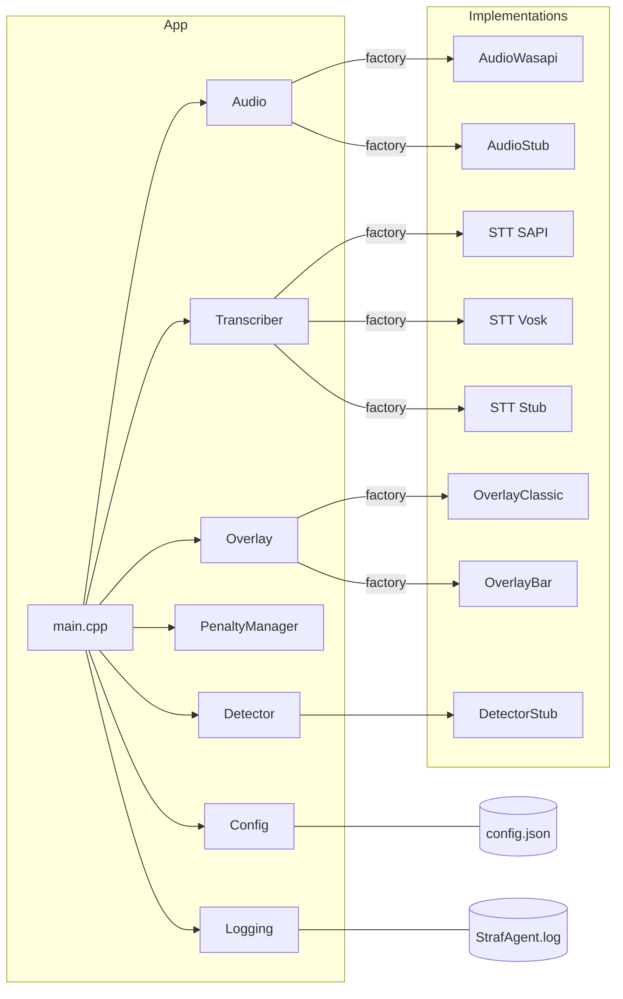
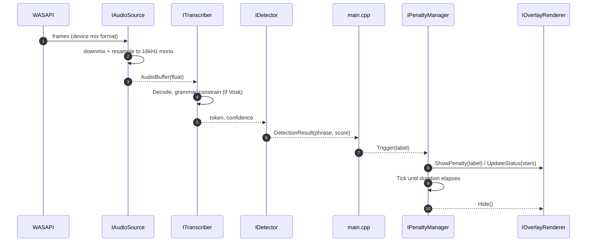
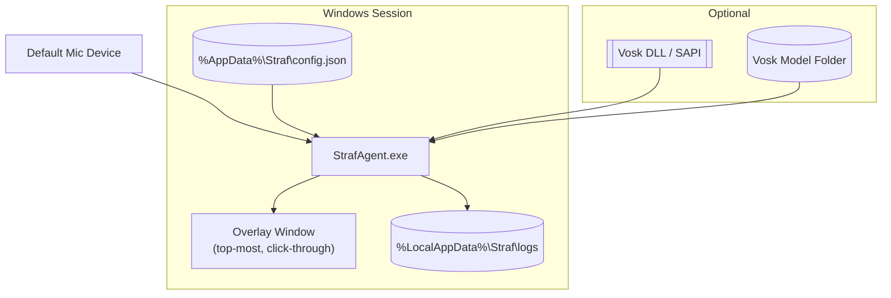

# Straf Architecture

This document describes the architecture of the Straf application: a Windows user agent that captures microphone audio, detects user-defined words, and applies on-screen penalties via an always-on-top overlay.

## Overview

- Language: C++20 on Windows 11
- Build: CMake; optional vcpkg for dependencies
- Binary: single executable `StrafAgent`
- Optional: Vosk-based offline STT (build flag) and a Windows Service (future)

Key responsibilities:
- Capture mic audio (WASAPI), optionally transcribe tokens (Vosk or SAPI), match against a configured vocabulary, and enqueue penalties.
- Render an always-on-top overlay (Direct3D11 + DirectComposition + Direct2D/DirectWrite) showing “stars” and labels GTA-style.
- Persist logs to `%LocalAppData%\Straf\logs\StrafAgent.log` and load configuration from `%AppData%\Straf\config.json`.

## Code Map

- Config: `include/Straf/Config.h`, `src/Config.cpp`
- Logging: `include/Straf/Logging.h`, `src/Logging.cpp`
- Audio: `include/Straf/Audio.h`, `src/AudioWasapi.cpp`, `src/AudioStub.cpp`
- STT: `include/Straf/STT.h`, `src/STTSapi.cpp`, `src/STTVosk.cpp`, `src/STTVoskStub.cpp`
- Detector: `include/Straf/Detector.h`, `src/DetectorToken.cpp` (token/phrase), `src/DetectorStub.cpp`
- Overlay: `include/Straf/Overlay.h`, `src/OverlayClassic.cpp`, `src/OverlayBar.cpp`
- Penalties: `include/Straf/PenaltyManager.h`, `src/PenaltyManager.cpp`
- Entry point / wiring: `src/main.cpp`

## Runtime Data Flow

```mermaid
flowchart LR
    Mic[Microphone (WASAPI)] -->|mono 16kHz float| Audio(IAudioSource)
    Audio -->|frames| STT[ITranscriber (Vosk/SAPI/Stub)]
    STT -->|tokens + confidence| Match[Case-insensitive match<br/>against configured words]
    Match --> Detect[DetectionResult]
    Detect --> Penalty[IPenaltyManager]
    Penalty --> Overlay[IOverlayRenderer]
```

Notes:
- `AudioWasapi` captures the default input device, downmixes to mono and resamples to 16 kHz if needed (see `src/AudioWasapi.cpp`).
- The STT backend is selected by `STRAF_STT` at runtime (`sapi`, `vosk`, or fallback `stub`). Vosk uses constrained grammar when a vocabulary is passed for low-latency keywording.
- Tokens are lowercased and matched against the configured vocabulary (set of strings) before triggering penalties.

## Component Diagram



## Sequence: Detection-to-Penalty



## Configuration

- Location: `%AppData%\Straf\config.json` (auto-copied from `config.sample.json` on first run). See `src/main.cpp:62` and `src/Config.cpp:20`.
- Shape:
  - `words`: list of strings to match
  - `penalty`: `durationSeconds`, `cooldownSeconds`, `queueLimit`
  - `audio`: `sampleRate`, `channels` (target for capture pipeline; currently 16 kHz, mono)
  - `logging`: `level` (`info` or `error`)

Environment overrides:
- `STRAF_CONFIG_PATH`: absolute path to a config file
- `STRAF_USE_SAMPLE_CONFIG`: use `./config.sample.json` instead of `%AppData%`

## Penalty Logic

- Starts immediately if no active penalty and cooldown has elapsed; otherwise queues up to `queueLimit`.
- `Tick()` transitions state when duration is over, then enforces cooldown before next item dequeues.
- Star count equals active + queued (clamped [0..5]) and drives overlay visuals.

Reference: `src/PenaltyManager.cpp:8` for state machine and queue handling.

## Overlay Rendering

- Always-on-top, borderless, click-through layered window using DirectComposition.
- D3D11 swap chain + D2D/DirectWrite for drawing banner, stars, and text.
- Two styles: Classic (GTA-like stars) and Bar (bottom bar).
- Select style via `STRAF_OVERLAY_STYLE=classic|bar`. Disable via `STRAF_NO_OVERLAY=1`.

References: `src/OverlayClassic.cpp:20`, `src/OverlayBar.cpp:1`.

## Audio Capture

- WASAPI shared-mode capture of default mic with event callbacks.
- Converts device mix format (float or 16-bit PCM) to float; downmixes to mono and resamples to 16 kHz.
- Emits 20ms-ish frames to consumers.

Reference: `src/AudioWasapi.cpp:1`.

## Speech-to-Text (STT)

- Pluggable backends behind `ITranscriber`:
  - SAPI: system dictation, local processing.
  - Vosk: offline ASR with optional constrained grammar for configured words.
  - Stub: no-op for development.
- Select at runtime via `STRAF_STT=sapi|vosk|stub`. Vosk needs `STRAF_ENABLE_VOSK=ON` at build time, `VOSK_INCLUDE_DIR`/`VOSK_LIBRARY`, and `STRAF_VOSK_MODEL` at runtime.

References: `include/Straf/STT.h:1`, `src/STTSapi.cpp:1`, `src/STTVosk.cpp:1`, `src/STTVoskStub.cpp:1`.

## Logging

- Info/error logging with timestamp; writes to OutputDebugString and file `%LocalAppData%\Straf\logs\StrafAgent.log`.
- Level from config `logging.level` (default `info`).

Reference: `src/Logging.cpp:1`.

## Build & Flags

- Build with MSVC or via CMake presets; optional vcpkg for `nlohmann-json`.
- Flags:
  - `STRAF_ENABLE_VOSK=ON` to include Vosk backend
  - `STRAF_ENABLE_CLANG_TIDY=ON` to run static analysis (if available)
  - `STRAF_USE_VCPKG=ON` to prefer vcpkg packages (default)
  - Runtime env: `STRAF_DETECTOR=token|stub` (default `stub`). When `token`, STT tokens stream into the token/phrase detector with debounce + threshold; otherwise legacy direct matching or stub.

Reference: `CMakeLists.txt:1`.

## Deployment Diagram



## Extensibility

- Factories make subsystems pluggable: `CreateAudioWasapi/CreateAudioStub`, `CreateTranscriber*`, `CreateOverlay*`.
- Add a new detector or overlay by implementing the interface and providing a factory.
- The STT layer and the simple `DetectorStub` can be unified or replaced by a more advanced keyword spotter if desired.

## Operational Concerns

- Performance: Real-time loops run on dedicated threads; WASAPI uses event callbacks. Keep STT grammar small for low latency.
- Privacy: All processing is local/offline; no audio persisted by default.
- Compatibility: Overlay avoids injection/hooks; draws via its own window to remain game/anti-cheat friendly.

## Open Items / Future Work

- Optional Windows Service to auto-start the agent in the user’s interactive session (no UI in session 0). IPC via named pipe if implemented.
- VAD and confidence thresholding to reduce false positives.
- Hot reload of config and dynamic vocabulary updates.
- Tests for config parsing and penalty state machine.
